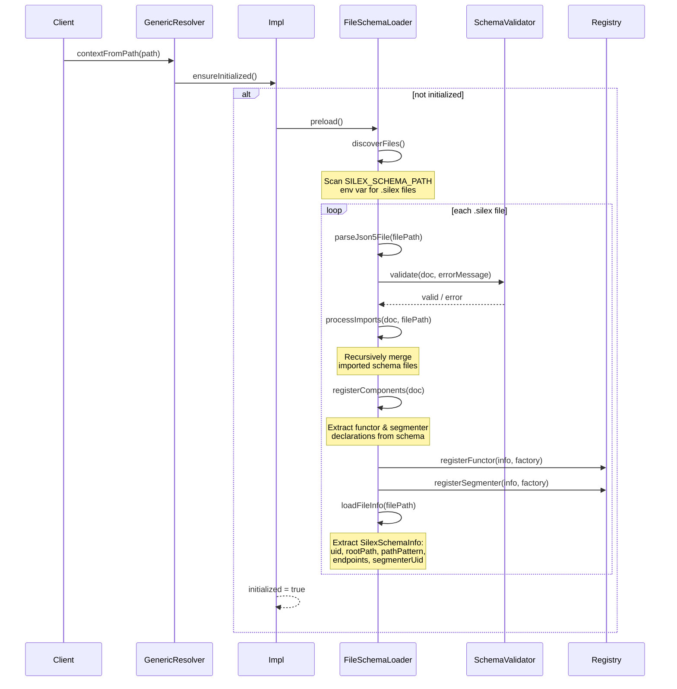
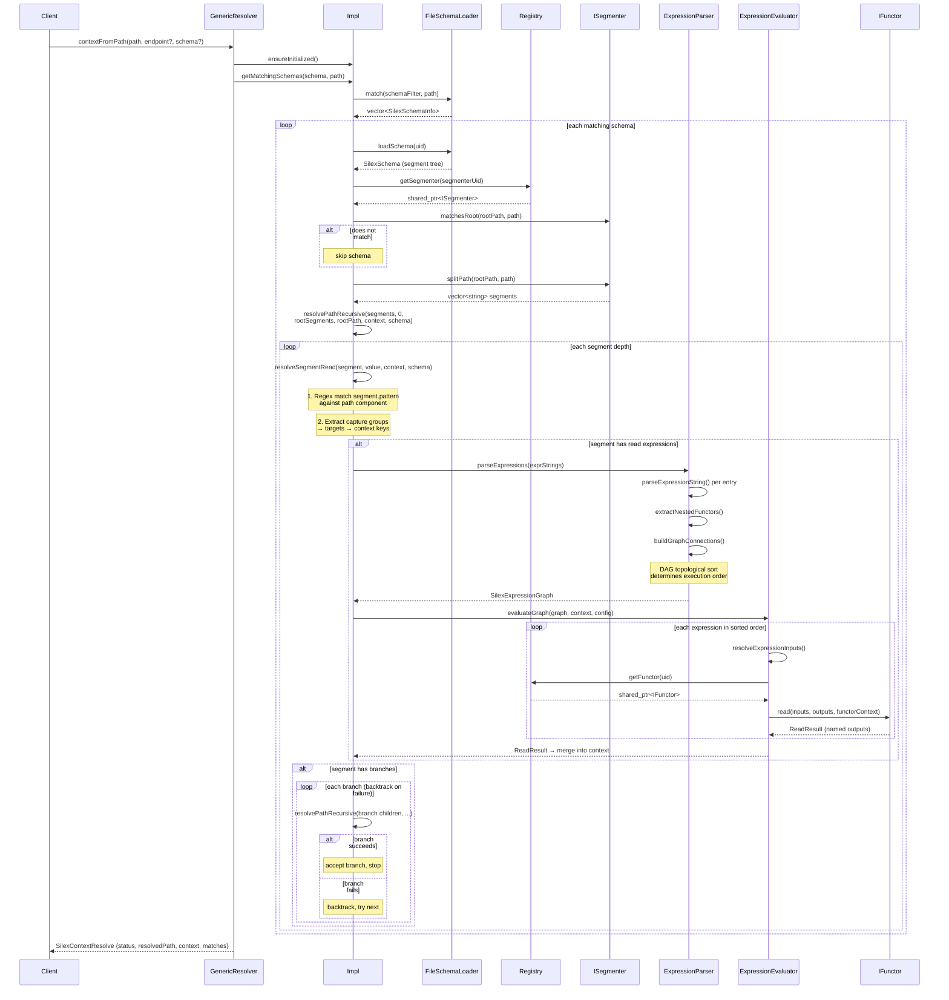
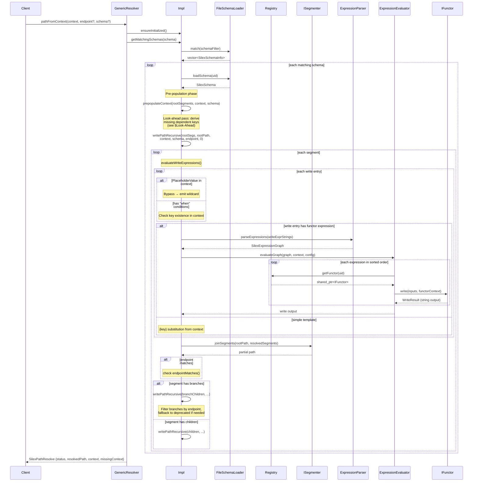
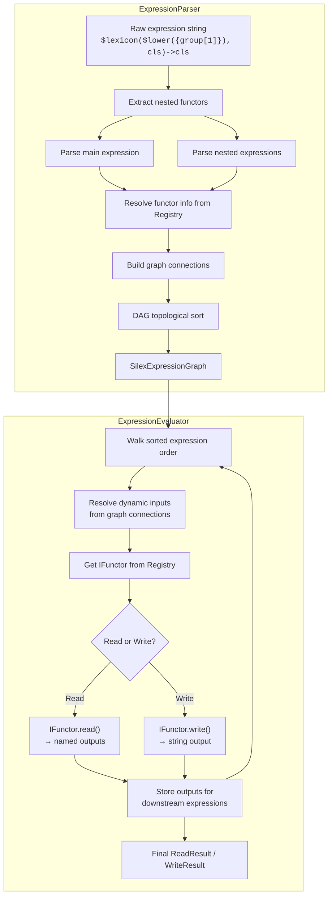
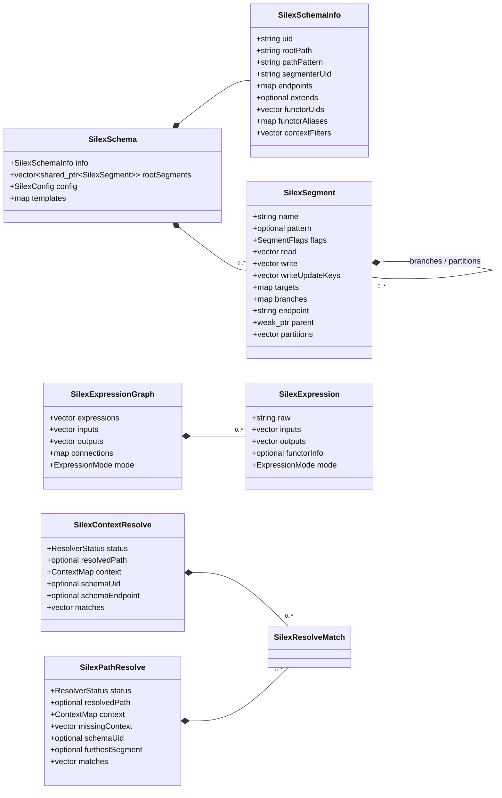

# Silex Architecture

Silex is a schema-driven path resolution engine for VFX pipelines. It bidirectionally converts between filesystem paths/URIs and structured context dictionaries using a graph-based schema architecture with pluggable functor expressions.

Built as a C++17 library with pybind11 Python bindings, Silex is designed for high-performance path resolution in production environments where thousands of asset paths must be parsed or generated per session.

## Public Surfaces

- C++ consumers include `include/silex/*.h` and instantiate `silex::resolvers::GenericResolver`.
- Python consumers import the compiled `silex` extension module built from `source/silex_core/bindings`.
- The Python root module re-exports `GenericResolver` from the `silex.resolvers` submodule and exposes the bound enums and result/data types directly on `silex`.
- Package builds install headers into `include/`, the shared library into `bin/` and `lib/`, and the Python extension plus runtime DLLs into `python/`.

## Source Tree Layout

```
source/silex_core/
├── include/silex/              # Public API headers
│   ├── export.h                # SILEX_API dllexport/dllimport macro
│   ├── constants.h             # Enums, verbosity, expression patterns
│   ├── structs.h               # All data structures
│   ├── GenericResolver.h       # Main resolver (PIMPL)
│   └── interfaces/             # Abstract interfaces
│       ├── IFunctor.h          #   Pluggable read/write operations
│       ├── ISegmenter.h        #   Path splitting strategies
│       ├── IResolver.h         #   Resolver contract
│       ├── ILoader.h           #   Schema discovery and loading
│       ├── IExpressionParser.h #   Expression string → graph
│       └── IExpressionEvaluator.h # Graph evaluation engine
├── src/                        # Private implementation
│   ├── registry/               # Component registry (keyed singleton)
│   │   ├── Registry.h/cpp      #   Unified functor/segmenter/schema store
│   │   └── BuiltinRegistrar.h/cpp # Registers built-in components
│   ├── schema/                 # Schema loading and validation
│   │   ├── FileSchemaLoader.h/cpp # .silex file discovery & parsing
│   │   ├── SchemaValidator.h/cpp  # JSON Schema validation
│   │   └── SchemaUtils.h/cpp     # Schema construction helpers
│   ├── expression/             # Expression parsing and DAG evaluation
│   │   ├── ExpressionParser.h/cpp # String → SilexExpressionGraph
│   │   ├── ExpressionEvaluator.h/cpp # Graph execution engine
│   │   └── DAG.h               # Topological sort (header-only)
│   ├── resolver/               # GenericResolver impl + helpers
│   │   ├── GenericResolver.cpp # Impl struct, contextFromPath, pathFromContext
│   │   └── ResolverHelpers.h/cpp # Pattern matching, context flattening
│   ├── functors/               # Built-in functors
│   │   ├── GlobFunctor.h/cpp
│   │   ├── GlobTagFunctor.h/cpp
│   │   ├── LexiconFunctor.h/cpp
│   │   ├── CaseConversionFunctor.h/cpp
│   │   └── CaseSplitFunctor.h/cpp
│   ├── segmenters/             # Path segmenters
│   │   ├── FilesystemSegmenter.h/cpp
│   │   └── URISegmenter.h/cpp  # Also contains QueryParamsSegmenter
│   └── util/                   # Logging, string utilities
└── bindings/                   # pybind11 Python bindings
    ├── module.cpp              # Module definition
    ├── bind_resolver.cpp       # GenericResolver bindings
    ├── bind_structs.cpp        # Data structure bindings
    └── bind_constants.cpp      # Enum/constant bindings
```

## Class Diagram

```mermaid
classDiagram
    direction TB

    class IResolver {
        <<interface>>
        +contextFromPath(path, endpoint?, schema?) SilexContextResolve
        +pathFromContext(context, endpoint?, schema?) SilexPathResolve
        +availableTemplates(schema?) vector~string~
        +contextFromTemplate(value, templateName, context?, schema?) ContextMap
        +valueFromTemplate(context, templateName, schema?) string
        +schemaFromPath(path) optional~string~
    }

    class GenericResolver {
        -unique_ptr~Impl~ m_impl
        +GenericResolver(options, schema, configId)
    }

    class Impl {
        -Registry& registry
        -FileSchemaLoader loader
        -SilexParseOptions options
        -string configId
        -bool initialized
        -unordered_map expressionCache
        +ensureInitialized()
        +getMatchingSchemas(schema?, path?) vector~SilexSchemaInfo~
        +resolveSegmentRead(segment, value, context, schema) SegmentResolve
        +resolvePathRecursive(segments, depth, rootSegs, rootPath, context, schema) SilexContextResolve
        +writePathRecursive(rootSegs, rootPath, context, schema, endpoint, depth) SilexPathResolve
        +prepopulateContext(segments, context, schema)
    }

    class Registry {
        -string m_name
        -map m_functorInfo
        -map m_functorCache
        -map m_functorFactories
        -map m_segmenterInfo
        -map m_segmenterCache
        -map m_segmenterFactories
        -map m_schemaInfo
        -map m_schemaCache
        +instance(key) Registry&$
        +registerFunctor(info, factory)
        +getFunctorInfo(name) optional~SilexFunctorInfo~
        +getFunctor(uid) shared_ptr~IFunctor~
        +registerSegmenter(info, factory)
        +getSegmenter(uid) shared_ptr~ISegmenter~
        +registerSchema(info)
        +cacheSchema(uid, schema)
        +clear()
        +clearCache()
    }

    class ILoader {
        <<interface>>
        +preload()
        +match(uidPattern?, path?, context?) vector~SilexSchemaInfo~
        +loadInfo(uid) SilexSchemaInfo
        +loadSchema(uid) SilexSchema
        +availableSchema() vector~string~
    }

    class FileSchemaLoader {
        -Registry& m_registry
        -map m_uidToPath
        -map m_uidToInfo
        -map m_uidToDoc
        -SchemaValidator m_validator
        -bool m_preloaded
        -discoverFiles()
        -loadFileInfo(filePath)
        -parseJson5File(filePath) Json::Value
        -processImports(doc, filePath)
        -registerComponents(doc)
        -buildSchema(uid) SilexSchema
    }

    class SchemaValidator {
        -nlohmann::json m_schemaDoc
        -bool m_loaded
        +loadSchema(schemaPath) bool
        +validate(document, errorMessage) bool
        +isLoaded() bool
    }

    class IExpressionParser {
        <<interface>>
        +parseExpressions(expressions) SilexExpressionGraph
    }

    class ExpressionParser {
        -Registry& m_registry
        -map schemaAliases
        -parseExpressionString(exprStr) vector~SilexExpression~
        -parseMainExpression(exprStr, mode, nested) optional~SilexExpression~
        -extractNestedFunctors(argsStr) pair
        -buildGraphConnections(expressions, mode) GraphConnections
        -resolveFunctorInfo(name) optional~SilexFunctorInfo~
    }

    class IExpressionEvaluator {
        <<interface>>
        +evaluateGraph(graph, context, config) ReadResult
        +evaluateReadExpression(expr, inputs, context, config) ReadResult
        +evaluateWriteExpression(expr, inputs, context, config) WriteResult
    }

    class ExpressionEvaluator {
        -Registry& m_registry
        -getFunctorInstance(info) shared_ptr~IFunctor~
        -createFunctorContext(info, context, config) FunctorContext
        -resolveExpressionInputs(expr, idx, graph, outputs, vars) vector~FunctorInput~
    }

    class DAG {
        -map m_adjacency
        -map m_inDegree
        +addNode(node)
        +addEdge(source, target)
        +isDAG() bool
        +topologicalSort() vector~int~
        +nodeCount() size_t
        +edgeCount() size_t
    }

    class IFunctor {
        <<interface>>
        +read(inputs, outputs, context) ReadResult
        +write(inputs, context) WriteResult
    }

    class ISegmenter {
        <<interface>>
        +pathPattern() string
        +splitPath(rootPath, path) vector~string~
        +joinSegments(rootPath, segments) string
        +matchesRoot(rootPath, path) bool
    }

    class GlobFunctor
    class GlobTagFunctor
    class LexiconFunctor
    class CaseConversionFunctor
    class CaseSplitFunctor
    class FilesystemSegmenter
    class URISegmenter
    class QueryParamsSegmenter

    GenericResolver ..|> IResolver
    GenericResolver *-- Impl

    Impl --> Registry : registry&
    Impl *-- FileSchemaLoader : loader
    Impl --> ExpressionParser : creates per-schema
    Impl --> ExpressionEvaluator : creates per-schema

    FileSchemaLoader ..|> ILoader
    FileSchemaLoader --> Registry : m_registry&
    FileSchemaLoader *-- SchemaValidator : m_validator

    ExpressionParser ..|> IExpressionParser
    ExpressionParser --> Registry : m_registry&
    ExpressionParser --> DAG : uses for topological sort

    ExpressionEvaluator ..|> IExpressionEvaluator
    ExpressionEvaluator --> Registry : m_registry&

    GlobFunctor ..|> IFunctor
    GlobTagFunctor ..|> IFunctor
    LexiconFunctor ..|> IFunctor
    CaseConversionFunctor ..|> IFunctor
    CaseSplitFunctor ..|> IFunctor

    FilesystemSegmenter ..|> ISegmenter
    URISegmenter ..|> ISegmenter
    QueryParamsSegmenter ..|> ISegmenter

    Registry --> IFunctor : stores factories & cache
    Registry --> ISegmenter : stores factories & cache
    Registry --> SilexSchemaInfo : stores metadata
```



## Schema Loading

When a resolver is first used, schemas are discovered and loaded from `.silex` JSON5 files on disk.



## Path → Context Resolution (contextFromPath)

Converts a filesystem path or URI into a structured context dictionary by matching against loaded schemas.



## Context → Path Resolution (pathFromContext)

Converts a context dictionary into a filesystem path or URI by evaluating write expressions.



## Endpoint Resolution

Endpoints are named leaf nodes in the schema's segment tree. They define the logical depth at which a path is considered "fully resolved."

A schema declares endpoints as a mapping of names to segment paths:

```json5
{
  "endpoints": {
    "entity": ["root", "project", "entity"],
    "component": ["root", "project", "entity", "step", "component"],
    "fragment": ["root", "project", "entity", "step", "component", "fragment"]
  }
}
```

During resolution, endpoint filtering restricts which branches and depths are explored:

- **Read (contextFromPath):** Resolution continues until it either reaches an endpoint or runs out of path segments. If an endpoint filter is provided, only branches leading to matching endpoints are explored.
- **Write (pathFromContext):** Resolution stops at the deepest segment that matches the requested endpoint. Branches that cannot reach the endpoint are skipped.

The `endpointMatches()` function supports both exact matching and tail matching:

```cpp
// Exact match
endpointMatches("entity", "entity")  // true

// Tail match: query suffix matches segment endpoint
endpointMatches("asset.entity", "entity")  // true
endpointMatches("shot.component", "component")  // true
```

This allows schemas to qualify endpoints with a context prefix (e.g., `asset.entity` vs `shot.entity`) while still matching against the schema-declared endpoint name.

## Deprecated Path Traversal

Schema segments can be flagged with `SegmentFlags::Deprecated` to indicate legacy path structures.

**Default behavior:**
- Deprecated segments are skipped during resolution
- `SilexParseOptions::includeDeprecated = false` by default

**Fallback mechanism:**
1. `writePathRecursive` first attempts resolution using non-deprecated segments only
2. If all non-deprecated branches fail, it retries with deprecated segments included
3. This allows old paths to still resolve while encouraging migration to new structures

**Tracking:**
- `SilexResolveMatch::usedDeprecatedTraversal` is set to `true` when deprecated segments were used
- Consumers can check this flag to warn users about deprecated path usage

**Override:**
- Setting `SilexParseOptions::includeDeprecated = true` forces deprecated segments to be considered alongside non-deprecated ones from the start

## Expression Parsing and DAG Evaluation

Expressions are the core mechanism for transforming values during resolution. They are strings embedded in schema segment definitions that invoke registered functors.

### Expression Syntax

```
$functor_name(arg1, arg2, ...)->output1, output2
```

- `$` prefix identifies a functor call
- Arguments can be literals, `{context_key}` variable references, or nested functor calls
- `->` separates inputs from named outputs (read mode only)
- Write mode expressions omit the arrow and produce a single string

### Nested Expressions

Expressions can be nested. The parser extracts inner calls and creates separate expression nodes:

```
$lexicon($lower({group[1]}), classification)->classification
```

Becomes two expressions:
1. `$lower({group[1]})` → produces intermediate result
2. `$lexicon(<result_of_1>, classification)->classification`

### Parsing and Evaluation Flow



### DAG Internals

The `internal::DAG` class is a lightweight header-only topological sorter:
- Nodes are integer expression indices
- Edges represent data dependencies (output of expression N feeds input of expression M)
- Kahn's algorithm (BFS with in-degree tracking) produces the execution order
- Cycle detection: if the sorted result size differs from node count, the graph has cycles

### Expression Caching

The `Impl` struct caches parsed `SilexExpressionGraph` objects keyed by concatenated expression strings. This avoids re-parsing identical expression sets across multiple resolution calls.

## Look-Ahead / Pre-Population

Before the write traversal begins, `prepopulateContext()` runs a look-ahead pass to derive missing context keys that write expressions will need.

**Problem:** Write expressions for deeper segments may depend on context keys that are produced by read expressions on earlier segments. Without pre-population, these keys would be missing.

**Solution:**

1. Walk all segments in the schema tree
2. For each segment with `writeUpdateKeys`:
   - Check if any candidate values already exist in the provided context
   - Run `resolveSegmentRead()` against those values to derive dependent keys
3. Merge derived keys into the working context
4. Recurse into all branches (not just the target endpoint) to catch deep dependencies

This ensures that by the time `writePathRecursive` begins, all required context keys are present for template substitution and functor evaluation.

## Branch Selection and Backtracking

Schema segments can define named branches that represent structural variations in the path hierarchy.

```json5
{
  "name": "entity_type",
  "branches": {
    "asset": [/* segments for asset paths */],
    "shot":  [/* segments for shot paths */],
    "default": [/* fallback segments */]
  }
}
```

### Read Traversal (contextFromPath)

1. Each branch is tried in declaration order
2. The first branch that successfully matches the remaining path segments wins
3. On failure, the resolver backtracks to the branch point and tries the next branch
4. `SilexParseOptions::maxBacktrackIterations` (default: 10) limits retry count

### Write Traversal (pathFromContext)

1. Branches are checked against the endpoint filter
2. Only branches that can reach the requested endpoint are attempted
3. If no branch succeeds, the `default` branch is tried as fallback
4. If all non-deprecated branches fail, deprecated branches are attempted

### Backtracking Limits

Deep schemas with many branches can cause combinatorial explosion. The `maxBacktrackIterations` option prevents runaway resolution by aborting after the limit is reached, returning a partial result with `ResolverStatus::Partial`.

## Built-in Components

### Functors

| Component | Aliases | Description |
|-----------|---------|-------------|
| `GlobFunctor` | `glob` | Filesystem glob pattern matching with result caching |
| `GlobTagFunctor` | `glob_tag` | Version/tag-aware file matching (v001, latest, published) |
| `LexiconFunctor` | `lexicon`, `L` | Bidirectional abbreviation ↔ full name mapping |
| `ConvertLowerCaseFunctor` | `lower_case`, `lowercase`, `lower` | Lowercase string conversion |
| `ConvertUpperCaseFunctor` | `upper_case`, `uppercase` | Uppercase string conversion |
| `ConvertTitleCaseFunctor` | `title_case`, `titlecase`, `title` | Title case string conversion |
| `SplitCamelCaseFunctor` | `camelcase`, `CC` | CamelCase split (read) / join (write) |
| `SplitSnakeCaseFunctor` | `snakecase`, `SC` | snake_case split (read) / join (write) |

### Segmenters

| Component | Description |
|-----------|-------------|
| `FilesystemSegmenter` | Windows/Linux filesystem path segmentation with root detection |
| `URISegmenter` | URI path segmentation (`scheme://authority/path`) |
| `QueryParamsSegmenter` | Query parameter segmentation (`?key=val&key=val`) |

All functors implement `IFunctor::read()` and `IFunctor::write()`. All segmenters implement `ISegmenter::splitPath()`, `joinSegments()`, `matchesRoot()`, and `pathPattern()`.

## Extension Points

### Custom Functors

Register a custom functor by implementing `IFunctor` and registering it with the `Registry`:

```cpp
#include <silex/interfaces/IFunctor.h>
#include <silex/structs.h>

class MyFunctor : public silex::IFunctor {
public:
    ReadResult read(const std::vector<FunctorInput>& inputs,
                    const std::vector<FunctorOutput>& outputs,
                    const FunctorContext& context) override {
        // Extract value from inputs, produce named outputs
        ReadResult result;
        result.success = true;
        result.outputs["my_output"] = ResolvedValue{std::string("value")};
        return result;
    }

    WriteResult write(const std::vector<FunctorInput>& inputs,
                      const FunctorContext& context) override {
        // Produce a single string from inputs
        WriteResult result;
        result.success = true;
        result.output = "generated_value";
        return result;
    }
};
```

Register it:

```cpp
auto& registry = silex::internal::Registry::instance();

silex::SilexFunctorInfo info;
info.uid = "my_package.my_functor";
info.name = "my_functor";
info.aliases = {"mf"};

registry.registerFunctor(info, []() {
    return std::make_shared<MyFunctor>();
});
```

From Python (via pybind11 bindings), custom functors can be registered as external resources in `.silex` schema files, pointing to a Python module and class.

### Custom Segmenters

Implement `ISegmenter` for non-standard path formats:

```cpp
#include <silex/interfaces/ISegmenter.h>

class DatabaseSegmenter : public silex::ISegmenter {
public:
    std::string pathPattern() const override {
        return R"(db://\w+/.*)";
    }

    std::vector<std::string> splitPath(
        const std::string& rootPath,
        const std::string& path) const override {
        // Split database path into logical segments
    }

    std::string joinSegments(
        const std::string& rootPath,
        const std::vector<std::string>& segments) const override {
        // Join segments into a database path
    }

    bool matchesRoot(
        const std::string& rootPath,
        const std::string& path) const override {
        // Check if path belongs to this root
    }
};
```

### Custom Loaders

Implement `ILoader` to load schemas from sources other than the filesystem (e.g., a database or remote service). The resolver's `Impl` currently uses `FileSchemaLoader`, but the `ILoader` interface allows alternative implementations.

### Schema-Declared Extensions

`.silex` schema files can declare external functors and segmenters inline:

```json5
{
  "functors": [
    {
      "uid": "my_package.my_functor",
      "name": "my_functor",
      "module": "my_package.functors",
      "language": "python",
      "aliases": ["mf"]
    }
  ],
  "segmenters": [
    {
      "uid": "my_package.db_segmenter",
      "name": "db_segmenter",
      "module": "my_package.segmenters",
      "language": "python"
    }
  ]
}
```

These are registered into the `Registry` during `FileSchemaLoader::preload()` and become available to all schemas in the same resolver instance.

## Key Data Structures


